# [Antimony](http://www.mattkeeter.com/projects/antimony/)
By [Matt Keeter](http://www.mattkeeter.com)

> A computer-aided design (CAD) tool from a parallel universe in which CAD software evolved from Lisp machines rather than drafting tables.

    

# [Apparatus](http://aprt.us)
By [Toby Schachman](https://twitter.com/tobiaschneider)

> A hybrid graphics editor and programming environment for creating interactive diagrams.

* [Strange Loop Talk](https://www.youtube.com/watch?v=i3Xack9ufYk)

    

# [Aseba](https://github.com/aseba-community/aseba)

> A set of tools which allow novices to program robots easily and efficiently.

* While Aseba isn't a visual programming tool itself, it does [contain one](https://www.thymio.org/en:visualprogramming).
* Paper: [Visual Programming Language for Thymio II Robot](http://stephane.magnenat.net/publications/Visual%20Programming%20Language%20for%20Thymio%20II%20Robot%20-%20IDC%20-%202014.pdf)

    

# [Befunge](http://catseye.tc/article/Languages.md#befunge-93)
by Chris Pressey of [Cat's Eye Technologies](https://catseye.tc)

> Befunge is a stack-based, reflective, esoteric programming language. It differs from conventional languages in that programs are arranged on a two-dimensional grid.

This [blog post](https://dorianbrown.dev/befunge/) by Dorian Brown does a fantastic job of visualizing the execution of Befunge, and includes an interactive playground.

* [Esolangs](https://esolangs.org/wiki/Befunge-93)
* [Wikipedia](https://en.wikipedia.org/wiki/Befunge)

    

# [Blender](https://www.blender.org/)
Blender is an open-source 3D animation program with several visual programming tools.

 

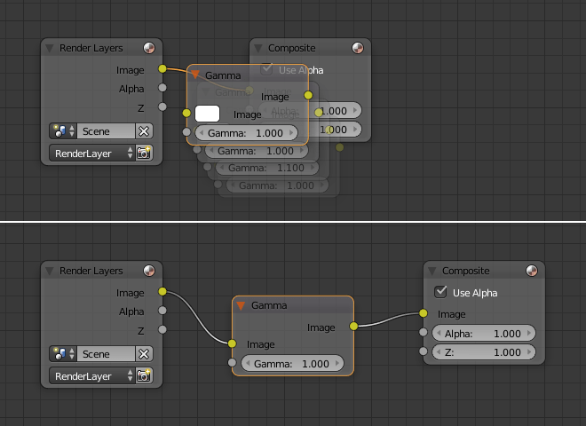

The [node editor](https://docs.blender.org/manual/en/latest/editors/node_editor/introduction.html) allows you to create materials (shaders), texture maps, and compositing flows. They're also used for [rendering](https://docs.blender.org/manual/en/latest/render/cycles/nodes/introduction.html).

 

The [logic editor](https://docs.blender.org/manual/en/latest/editors/logic_editor.html) is used to set up game logic for Blender's built-in game engine. The interface seems like a slightly different take on patching, with a 3-step `sensor > controller > actuator` layout.

    

# [Blockly](https://developers.google.com/blockly/)
by Neil Fraser with Quynh Neutron, [Ellen Spertus](https://en.wikipedia.org/wiki/Ellen_Spertus), and Mark Friedman at Google.

A JavaScript library for building Scratch-like block-based visual programming editors. Block code can be transpiled into JavaScript, Python, PHP, Dart, or other languages. An outgrowth of the [App Inventor](https://en.wikipedia.org/wiki/App_Inventor_for_Android) project.

* [Interview with Neil Fraser](https://opensource.com/education/15/2/blockly-makes-easier-every-one-learn-code)
* [Wikipedia](https://en.wikipedia.org/wiki/Blockly)

    

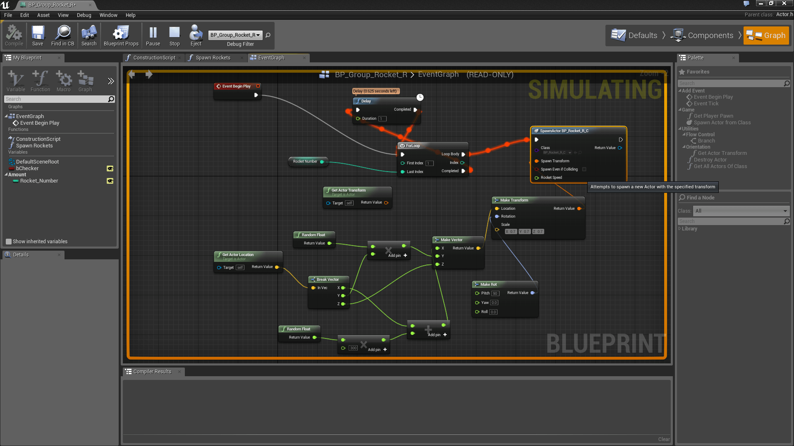

# [Blueprint](https://docs.unrealengine.com/en-us/Engine/Blueprints)

A scripting system built into the Unreal Engine.

* [Blueprints From Hell](https://blueprintsfromhell.tumblr.com) is a Tumblr collecting examples of large or messy Blueprint scripts.

    

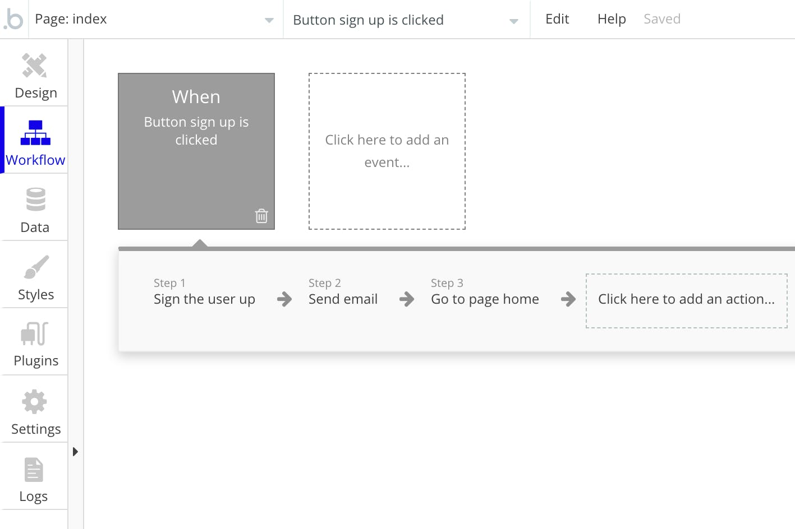

# [Bubble](https://bubble.is)

A drag-and-drop tool for creating web applications. There's a visual design mode that looks a bit like Keynote or iBooks Author, and a "Workflow" programming mode that seems similar to [IFTTT](#ifttt).

* Blog: [Creating a $100,000/mo Business That Helps People Learn to Code](https://www.indiehackers.com/businesses/bubble)
    * [HN Discussion](https://news.ycombinator.com/item?id=15681379)

    

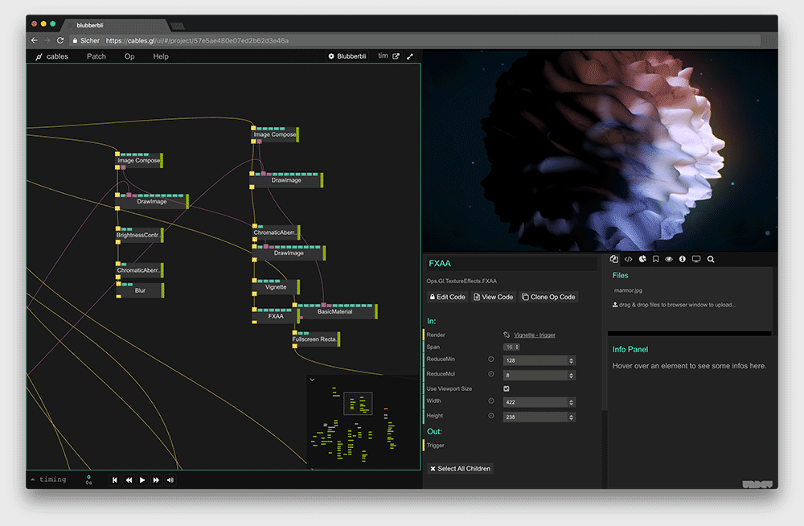

# [Cables](https://cables.gl)
by [Undev](https://undev.studio)

> Cables is your model kit for creating beautiful interactive content. With an easy to navigate interface and results in real time, it allows for fast prototyping and prompt adjustments.
> Working with cables is just as easy as creating cable spaghetti:
> You are provided with a given set of operators such as mathematical functions, shapes and materials.
> Connect these to each other by virtual cables to create the scene you have in mind.
> Easily export your piece of work at any time. Embed it into your website or use it for any kind of creative installation.

    

# [Chain](https://github.com/mimorisuzuko/chain)

> A New Visual Programming Environment to Build JavaScript By Linking Blocks.

Not particularly interesting on its own, but [Cochain](https://github.com/mimorisuzuko/chain/tree/feature/co) is cute.

    When I first read the word "coedit" I thought they meant the [dual](https://en.wikipedia.org/wiki/Dual_(category_theory)) of "edit" and got *very* excited, wondering what that could mean. Alas. Exercise for the reader! (Let me know what you come up with)

    

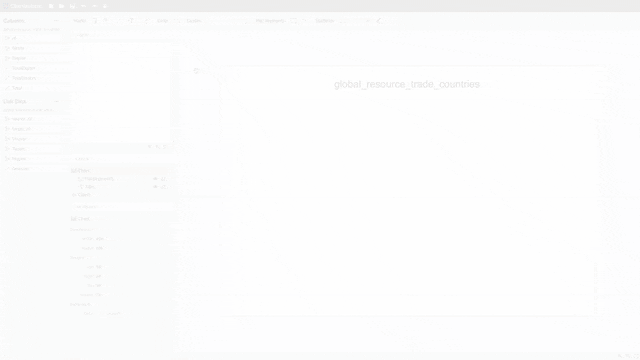

# [Charticulator](https://charticulator.com)

> Interactive Construction of Bespoke Chart Layouts

A project from Microsoft research for building data visualizations using direct manipulation of graphics, very similar to (and presumably inspired by) Bret Victor's [Drawing Dynamic Visualizations](reflections.md#drawing-dynamic-visualizations)

    

# [CodeFlow](http://codeflow.co)

A VPL editor that appears to be geared toward building NodeJS server apps.

Created by [Murukesh Sadasivan](https://twitter.com/murukeshs)

    

# [Cinema 4D Xpresso](https://help.maxon.net/us/#5829)

A rudimentary nodes-and-wires patcher used for procedural animation and rule-based particle effects in [Cinema 4D](https://en.wikipedia.org/wiki/Cinema_4D).

You can read my impressions [here](impressions/cinema-4d-xpresso.md).

    

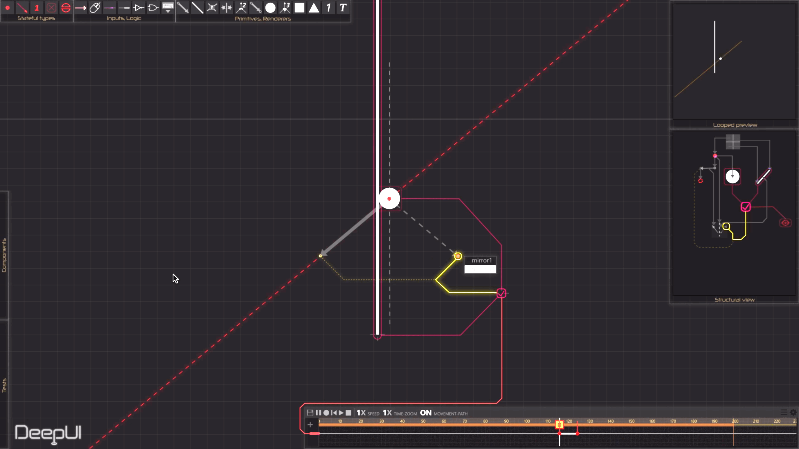

# [DeepUI](https://deepui.io)
by [Arnold Lágler](https://twitter.com/DeepUINews)

Inspired by [Bret Victor's Drawing Dynamic Visualizations](reflections.md#bret-victor). The developer made a rough prototype (unreleased) and a concept video (shown on the website), but then wasn't able to continue working any further on this project, sadly. They suggested to me that they believe [Luna](#luna) to be more promising direction because it's more generic and not restricted to the domain of interactive animations.

    

# [DRAKON](http://drakon-editor.sourceforge.net)

> The language provides a uniform way to represent flowcharts of any complexity that are easy to read and understand.

* [Wikipedia](https://en.wikipedia.org/wiki/DRAKON)
* [HN Discussion](https://news.ycombinator.com/item?id=10100932)

    

# Duangle Prototypes: Noodles, Conspire

Prototypes created by Leonard Ritter of Duangle for their game Nowhere.

Blog post: [Conspire: A Programming Environment for NOWHERE](http://blog.duangle.com/2015/01/conspire-programming-environment-for.html)

Noodles includes a "compact" feature, which wraps selected node boxes into a new node, preserving connections.

Conspire is a Lisp-like (so non-visual, but...), designed to be extended in terms of itself: "And then it hit me: what if the editor was built from the grounds up with Lispy principles: the simplest graphically based visualization possible, extensible from within the editor, so that the editor would factually become an editor-editor"

    

# [Dynamicland](http://dynamicland.org)

Programing wrested away from the screen, rendered into that most immersive and expressive medium: the physical world.

    

# Fabrik

Built in SmallTalk by [Apple ATG](https://en.wikipedia.org/wiki/Apple_Advanced_Technology_Group)

Paper: [Fabrik: A Visual Programming Environment](http://sp.cmc.msu.ru/courses/smalltalk/fabrik/Fabrik.html)

  [HN Discussion](https://news.ycombinator.com/item?id=12104463)

    

# [Fizzygum](http://fizzygum.org)

A new SmallTalk/HyperCard-like tool

    

# [Genesis](https://github.com/rff255/Genesis)

IDE for modeling and simulation of Cellular Automata

    

# [Github Actions](https://github.com/features/actions)

A tool for configuring workflows triggered by Github repo events.

    

# [Glance](https://github.com/rgleichman/glance)

A visual Haskell

This language has a particularly neat rendering style. I recommend taking a look at [Advantages of Glance](https://github.com/rgleichman/glance/wiki/Advantages-of-Glance) for examples.

    

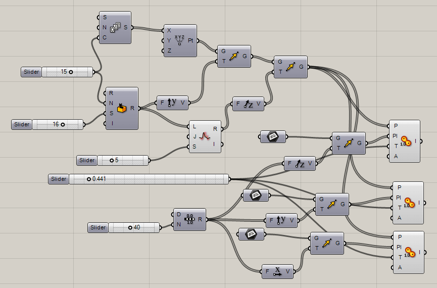

# [Grasshopper](http://www.grasshopper3d.com)

A VPL for procedural modelling in Rhino. It's neat that it uses little icons for nodes instead of names.

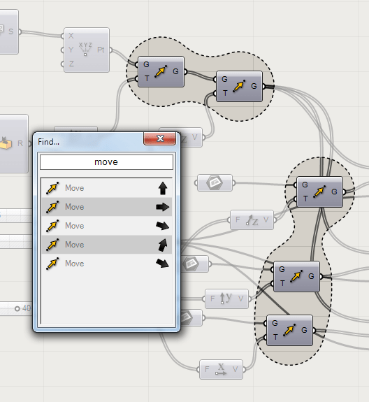

Grasshopper has a neat way of rendering the results of a "find" operation.

    

# Hopscotch

[Wikipedia](https://en.wikipedia.org/wiki/Hopscotch_(programming_language))

    

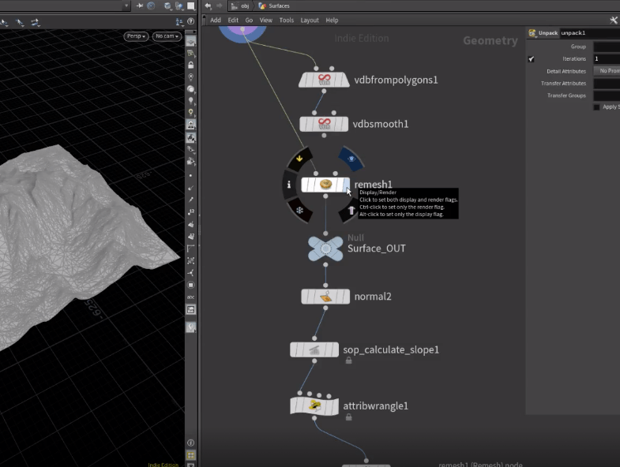

# [Houdini](https://en.wikipedia.org/wiki/Houdini_(software))
by [SideFX](https://www.sidefx.com)

A suite of 3d modelling and visual effects tools, with a number of different VPLs serving various uses.

    

# [IFTTT](https://ifttt.com)

A popular, basic tool for connecting and automating a handful of apps, services, and APIs. The name is short for _If This Then That_.

[Wikipedia](https://en.wikipedia.org/wiki/IFTTT)

    

# [Interstate](http://interstate.from.so)

A language+environment designed to show interactive behaviour with more clarity, using state machines and constraints.

Includes: A live updating preview of the running program, a table view with current variable values, a schematic-like view of the state machine with animated transitions and current state highlighting, and highlighting of related elements across representations.

[Demo Video](https://www.youtube.com/watch?v=M--9jsuDZis)

    

# [Joy.js](http://ncase.me/joy/demo/turtle/) by [Nicky Case](https://twitter.com/ncasenmare)

A live programming environment with *excellent* use of visual interactivity. For example, by gradually moving your mouse down the number bullets that mark each (imperative) step of the program, you see that step's execution gradually take place.

    

# LabVIEW

[Wikipedia](https://en.wikipedia.org/wiki/LabVIEW)

    

# [Lire](https://github.com/honix/Lire)

"Lire is a Lisp expressions visual editor, it allows you to write programs using kind of abstract syntax tree (AST). It runs on top of Common Lisp."

The layout of nodes is quite distinct — it feels more like a transit map (or [Mini Metro](inspirations.md#mini-metro)) than most patcher VPLs.

    

# [Litegraph.js](https://github.com/jagenjo/litegraph.js)

"A graph node engine and editor written in Javascript similar to [PD](#pure-data) or [UDK Blueprints](#blueprint), comes with its own editor in HTML5 Canvas2D. The engine can run client side or server side using Node. It allows to export graphs as JSONs to be included in applications independently."

Handy list of [projects using Litegraph](https://github.com/jagenjo/litegraph.js#projects-using-it)

    

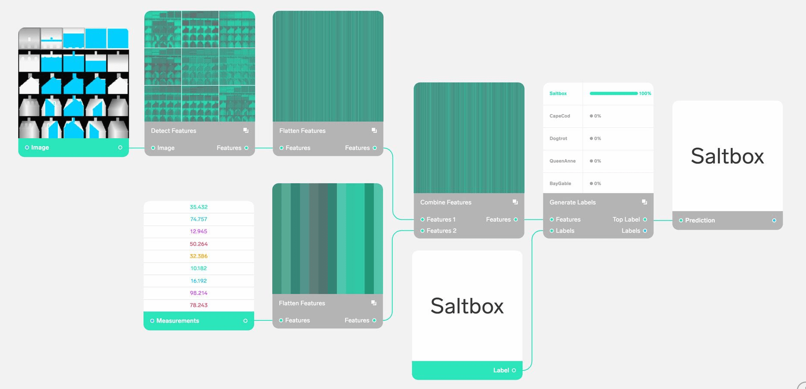

# [Lobe](https://lobe.ai)
by [Mike Matas](https://en.wikipedia.org/wiki/Mike_Matas), [Jaron Lanier](https://en.wikipedia.org/wiki/Jaron_Lanier), et al. Now owned by Microsoft.
> Build, train, and ship custom deep learning models using a simple visual interface.

    

# [Luna](http://www.luna-lang.org)

A new VPL with a simultaneous textual/visual view of the program.

Subreddit: [LunaLang](https://www.reddit.com/r/LunaLang/)

Video: [Wojciech Daniło & Marcin Kostrzewa Luna - Purely functional paradigm meets visual programming](https://www.youtube.com/watch?v=DhR6XWUBsvg)

Medium post: [Luna, the visual way to create software](https://medium.com/@luna_language/luna-the-visual-way-to-create-software-c4db520d6d1e)

HN: [Luna – Visual and textual functional programming language](https://news.ycombinator.com/item?id=14612680)

HN: [Luna 1.0 Beta is out](https://news.ycombinator.com/item?id=16163769)

    

# [Max/MSP](https://cycling74.com/products/max)

A commercial VPL for musicians and artists, evolved out of [Pure Data](#pure-data).

Likely one of the most famous visual programming languages, widely used for more than 20 years.

    

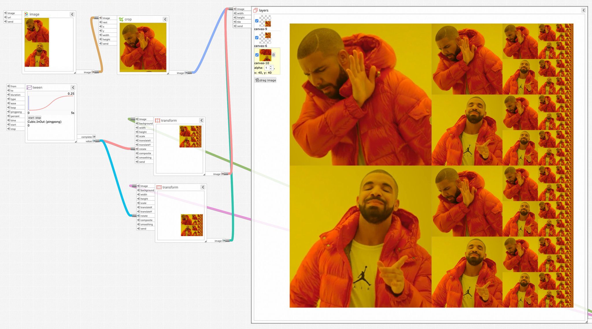

# [Meemoo](https://meemoo.org)
by [Forrest Oliphant](https://www.forresto.com)

A web-based tool for building interactive audio/visual projects.

Designed to encourage hacking and modding, like [circuit bending](https://en.wikipedia.org/wiki/Circuit_bending) but for software. For instance, you can edit the "meta drake" shown above [here](https://app.meemoo.org/#gist/8b234cbbfb2132b329fd45b82be90b0e). (Be sure to click the "start" button in the tween node.)

[Paper](https://meemoo.org/files/ForrestOliphant-MeemooThesis-web.pdf)

    

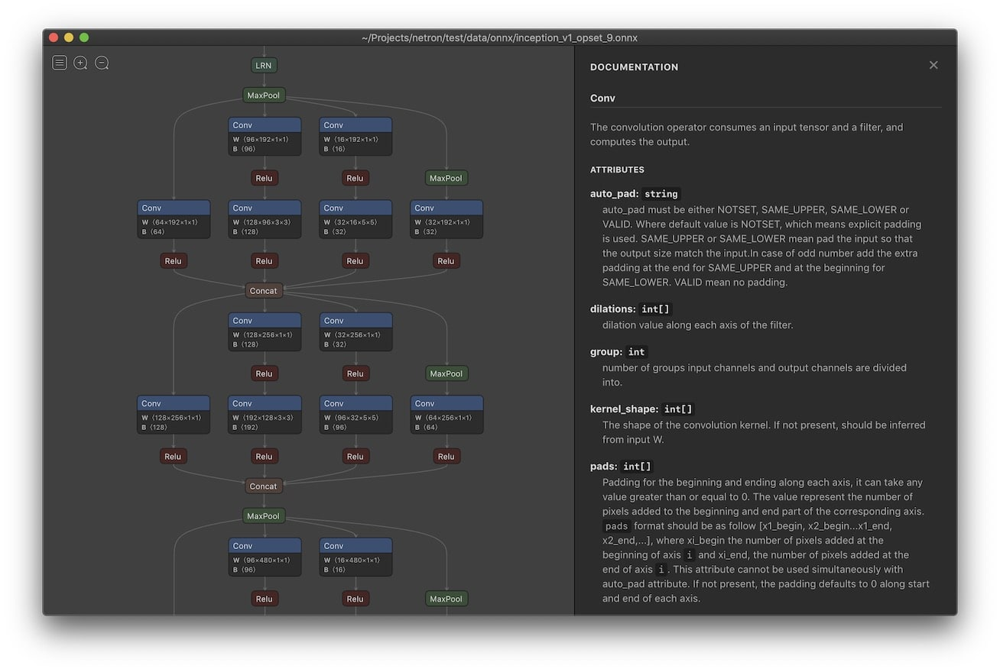

# [Netron](https://github.com/lutzroeder/netron)
by [Lutz Roeder](https://www.lutzroeder.com)

> Visualizer for neural network, deep learning and machine learning models

    

# [Node-RED](https://nodered.org)

"A programming tool for wiring together hardware devices, APIs and online services in new and interesting ways. It provides a browser-based editor that makes it easy to wire together flows using the wide range of nodes in the palette that can be deployed to its runtime in a single-click."

    

# [NodeBox](https://www.nodebox.net)

A dataflow environment created by the [Experimental Media Research Group](https://www.emrg.be) for datavis, generative design, and animations.

    

# [NoFlo](https://noflojs.org)

A flow-based programming environment for JavaScript, targeting the web and Node.js.

Related projects: [Flowhub](app.flowhub.io), [noflo-ui](https://github.com/noflo/noflo-ui)

    

# [Nodes](http://nodes.io)
by [Variable](http://variable.io)

> Nodes is your thinking space for exploring ideas with code on the web, powered by JavaScript and NPM.
> What if programming was about ideas not semicolons? Compose, abstract, generalise. Start from top down or bottom up and refine as you go. With Nodes programming feels like sketching on canvas. Zoom in and out of problems, experiment on the side and easily re-use parts of other projects.

* They've written a fantastic [blog post](http://nodes.io/story/#how-do-i-get-nodes) introducing the project and contextualizing it relative to similar tools.

    

# [OpenPonk](https://modeling-languages.com/openponk-metamodeling-platform/)

A meta-modelling tool built on top of [Pharo](https://pharo.org/) (a SmallTalk dialect), used to experiment with the creation of modelling tools.

    

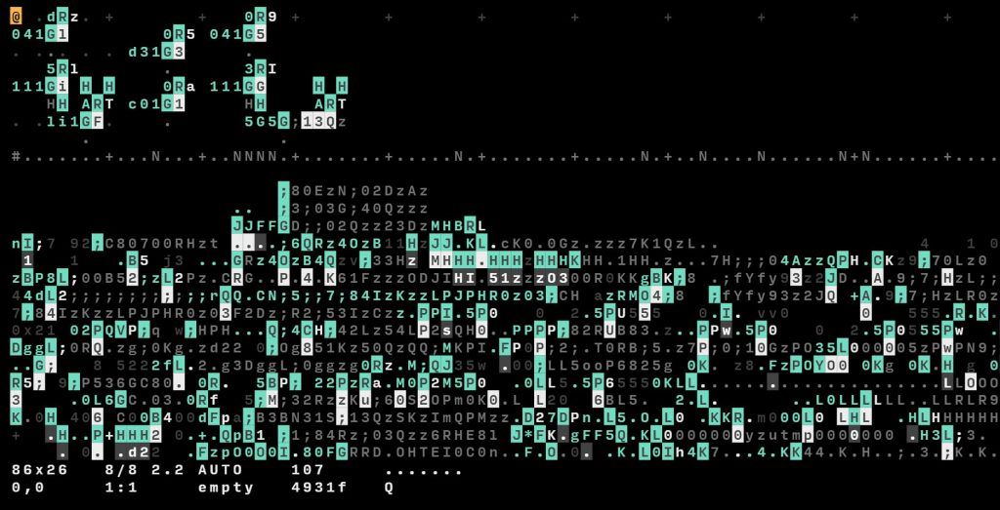

# [ORCΛ](https://wiki.xxiivv.com/#orca)
by [Devine Lu Linvega](https://xxiivv.com)

> Orca is a visual programming playground. Orca is an esoteric programming language, designed to create procedural sequencers. Each letter of the alphabet is an operation, uppercase letters operate each frame, lowercase letters operate on bang.

* [Example 1](https://twitter.com/neauoire/status/1135510882807500800)
* [Example 2](https://twitter.com/neauoire/status/1149853206018584576)

    

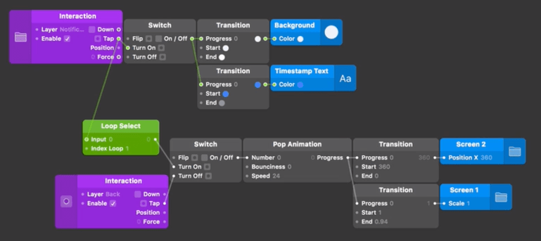

# [Origami](https://origami.design)
By Facebook

A prototyping tool originally built atop [Quartz Composer](#quartz-composer), but more recently rebuilt as a standalone (albeit less capable) app.

* Used to prototype the UI/UX of their Paper app.

* I've found that it offers a few interesting tweaks on the common nodes-based VPL format, though with a raft of apparent shortcomings. You can read more of my impressions [here](impressions/origami.md).

    

# PA3D

[Video demo](https://www.youtube.com/watch?v=5JzaEUJ7IbE) — "PAD3D was a very early (about 1993) zoomable user interface implemented on an SGI in Lisp using accelerated 3D graphics.  This demo shows zooming, authoring, text, images, dynamic fisheye of source code, live visual bookmarks, and a nested zooming file browser."

    

# [Parabola](https://parabola.io)

A simple VPL for automating tasks, similar to [IFTTT](#ifttt).

[HN Discussion](https://news.ycombinator.com/item?id=17147272)

    

# [Patternodes](https://www.lostminds.com/patternodes2/)

A nice-looking VPL for creating repeating pattern graphics

Includes features for creating animated patterns

    

# [Piet](http://www.dangermouse.net/esoteric/piet.html)

"Piet is a programming language in which programs look like abstract paintings."

[Example programs](http://www.dangermouse.net/esoteric/piet/samples.html)

    

# PIM — Programming In the Model

Research project by Myriam Maleki

A visual scripting interface for parametric CAD

Echoes some of the ideas in Bret Victor's Learnable Programming and Drawing Dynamic Visualizations

[Demo View](https://www.youtube.com/watch?v=U59Lr7WvEOo) (seemingly contains no sound — bummer)

[Overview](http://papers.cumincad.org/data/works/att/acadia13_191.content.pdf)

[Paper](http://clab.iat.sfu.ca/pubs/Maleki-PIM-DIS.pdf)

    

# [PraxisLive](https://www.praxislive.org)

A visual IDE for creative coding, focussing on realtime audio and video (OpenGL).

On [Twitter](https://twitter.com/PraxisLIVE)

    

# [Pure Data](https://puredata.info)

[Wikipedia](https://en.wikipedia.org/wiki/Pure_Data)

An open source VPL for musicians and artists. Pure Data (Pd) is the prototypical example of a VPL — boxes that direct or transform flowing data, connected together with lines through which the data flows. Pd has distinctly-styled lines for messages (strings) and for signals (audio data), and type-specific "objects" (boxes) like `sin` for messages and `sin~` for signals.

The help and tutorial documents are implemented as Pd patches, and you are encouraged to edit them.

    

# [Quartz Composer](https://en.wikipedia.org/wiki/Quartz_Composer)

A tool from Apple for creating animations and prototypes, leveraging technologies in macOS like CoreImage.

    

# [Recursive Drawing](http://recursivedrawing.com)

"an exploration of user interface ideas towards the development of a spatially-oriented programming environment."

by Toby Schachman

Reflected on [here](reflections.md#by-toby-schachman)

    

# [Rete](https://github.com/retejs/rete)

Allows you to create node-based editors in the browser.

"You can define nodes and workers that allow users to create instructions for processing data in your editor without a single line of code."

This project seems pretty rough, but it's surprisingly popular. There might be something to it that wasn't immediately obvious to me in my initial quick kick of the tires.

    

# [Retrobatch](https://flyingmeat.com/retrobatch/)

A node-based batch image processor

    

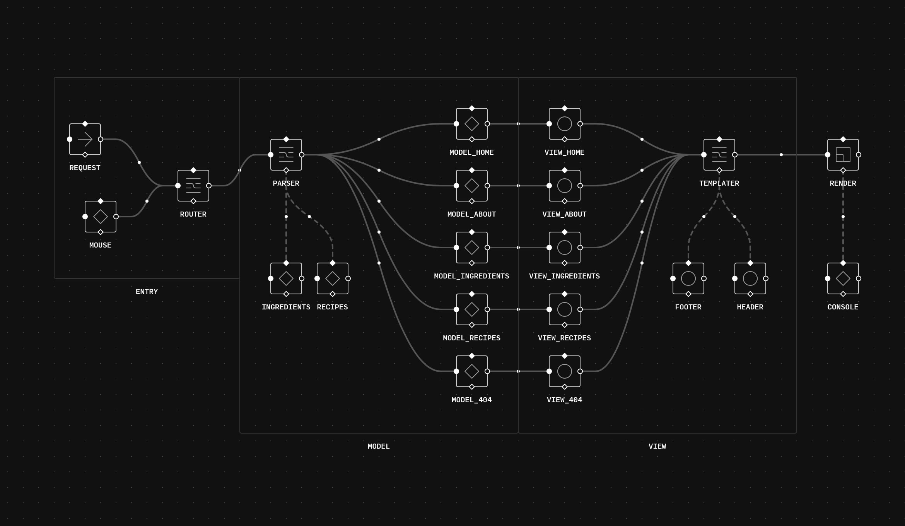

# [Riven](https://wiki.xxiivv.com/#riven)
by [Devine Lu Linvega](https://xxiivv.com)

A flow-based framework for creating websites.

Devine has a striking sense of aesthetics, and Riven is no exception.

You can view (though I don't believe edit) [the Riven program](https://wiki.xxiivv.com/riven.html#home) that configures the server for their website.

    

# [SchemeBricks](http://www.pawfal.org/dave/index.cgi?Projects/Scheme%20Bricks)

by Dave Griffiths [[Site](http://www.pawfal.org/dave/)] [[Twitter](https://twitter.com/nebogeo)]

    

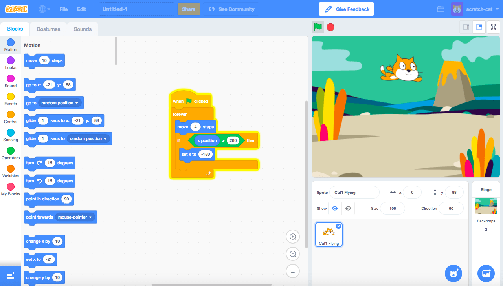

# Scratch

A VPL designed mainly for children. Scratch is a text-centric language that you assemble using blocks that snap together, with the syntax rules enforced by the shape of the blocks. Color is used to indicate a block's type of data or behaviour.

[Wikipedia](https://en.wikipedia.org/wiki/Scratch_(programming_language))

[Scratch 3.0](https://llk.github.io/scratch-gui/), which runs in the browser

    

# [Shadershop](http://tobyschachman.com/Shadershop/)

"Shadershop is an interface for programming GPU shaders in the mode of a direct manipulation image editor like Photoshop. It is an experiment in leveraging the programmer’s spatial reasoning the way that coding today leverages the programmer’s symbolic reasoning."

By Toby Schachman

    

# Sketchpad

One of the first GUIs ever, created by [Ivan Sutherland](https://en.wikipedia.org/wiki/Ivan_Sutherland) in 1963.

[Wikipedia](https://en.wikipedia.org/wiki/Sketchpad)

[HN Discussion](https://news.ycombinator.com/item?id=8912137)

[HN Discussion](https://news.ycombinator.com/item?id=13932586)

    

# [Snap!](https://snap.berkeley.edu)

A [Scratch](#scratch)-inspired block-snapping VPL with first-class procedures, lists, objects, and continuations.

"a broadly inviting programming language for kids and adults that’s also a platform for serious study of computer science"

    

# [Skov](http://skov.software/en/)

A rather neat-looking VPL, vaguely reminiscent of [Scratch](#scratch) (ie. not a patch-based VPL). Very tree-centric. Based on [Factor](https://github.com/factor/factor/).

[Github](https://github.com/nicolas-p/skov)

    

# [Softimage ICE](https://en.wikipedia.org/wiki/Autodesk_Softimage#ICE_Interactive_Creative_Environment)

A node-based VPL for scripting Softimage. Useful for procedural modelling, deformation, rigging, particle simulation, animation, etc.

    

# [SwiftVPL](https://github.com/NathanFlurry/VisualProgrammingLanguage)

"node-based visual programming language that assembles executable Swift code and can be written using an Apple Pencil or touch"

    

# ThoughtTalk

A prototype for directly manipulating abstractions by [Sean McDirmid](https://twitter.com/seanmcdirmid18)

[Demo Video](https://www.youtube.com/watch?v=e6ZyswW_0oo)

    

# [Tombstone Engine](http://tombstoneengine.com)

A game engine that includes some VPL editor tools: A [shader editor](http://tombstoneengine.com/wiki/index.php?title=Shader_Editor) and [script editor](http://tombstoneengine.com/wiki/index.php?title=Script_Editor).

    

# [TouchDesigner](http://derivative.ca)

Features a node-based programming environment (mainly for multimedia) that is extendable/interoperable with Python

    

# [UAV Toolkit](https://fo.am/uav-toolkit/)

by Dave Griffiths [[Site](http://www.pawfal.org/dave/)] [[Twitter](https://twitter.com/nebogeo)]

    

# [Unison](http://unisonweb.org)

    

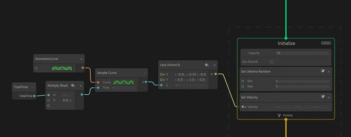

# [Unity Visual Effect Graph](https://unity.com/visual-effect-graph)
by [Unity](https://unity.com)

> A tool for building real-time visual effects in Unity. The tool uses GPU run compute shaders, and a node-based workflow.

* Introductory [Demo Video](https://www.youtube.com/watch?v=SUZzJcBIK80) and [Blog Post](https://blogs.unity3d.com/2018/11/27/creating-explosive-visuals-with-the-visual-effect-graph/)
* Documentation [on Github](https://github.com/Unity-Technologies/ScriptableRenderPipeline/wiki/Visual-Effect-Graph)

    

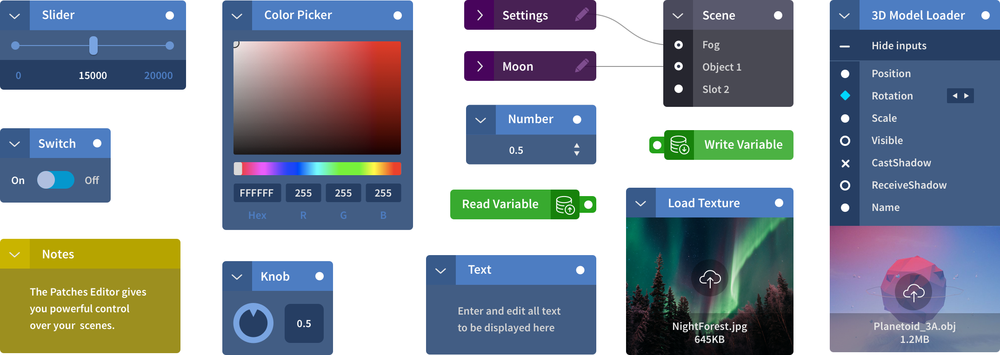

# [Vizor Patches](https://patches.vizor.io)
by [Vizor](https://site.vizor.io)

> Patches is a visual programming editor for building WebVR and WebGL experiences. With over 350 patches, ranging from low level programming, loops, variables and arrays to colour pickers and interaction triggers, Patches is a powerful and flexible modular system for building complex webVR projects. Patches is free to use, released under an MIT licence. It offers a UI to the popular Three.js library.

    

# [Vogo](http://mgrf.de/vogo/)

Direct manipulation interface for [turtle graphics](https://en.wikipedia.org/wiki/Turtle_graphics)

    

# [Vuo](https://vuo.org)

A high-performance patcher VPL for live VJ-ing, similar to [vvvv](#vvvv), Processing, and [Max](#max-msp).

Here's an interesting page: [How does Vuo compare to other creative coding environments?](https://vuo.org/compare/building) (Be sure to flip through the various tabs)

    

# [vvvv](https://vvvv.org)

A hybrid visual/textual live-programming environment. "It is designed to facilitate the handling of large media environments with physical interfaces, real-time motion graphics, audio and video that can interact with many users simultaneously."

[Wikipedia](https://en.wikipedia.org/wiki/Vvvv)

    

# [WoofJS](http://woofjs.com/teach.html)
by [Steve Krouse](reflections.md#steve-krouse)

    

# [XOD](https://xod.io)

A vertical patcher VPL for microcontrollers, with a nice looking grid structure (rows with gutters)

    

# [Zells](http://zells.org)

by [Nikolas Martens](http://rtens.org)

Prototype 5 [demo video](https://www.youtube.com/watch?v=T0fLZ8XceLo): A spatial VPL that uses omnidirectional pulses to convey data and drive execution.
